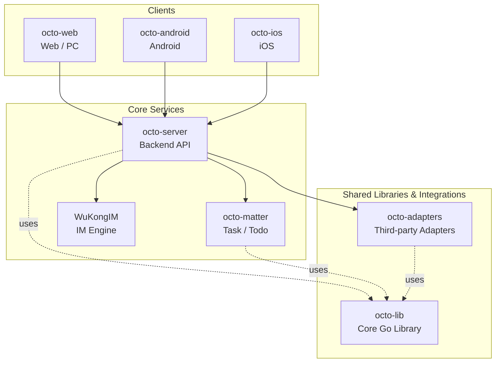

<p align="center">
  
  
</p>

<p align="center">
  <b>OCTO — the open workplace built for humans × AI agents.</b><br/>
  <sub>Let <b>Lobsters</b> (OpenClaw-powered digital doubles) do the <i>thinking</i> and <i>doing</i>. You focus on <i>taste</i>.</sub>
</p>

<p align="center">
  <a href="https://github.com/Mininglamp-OSS"><b>🏠 OCTO Home</b></a> ·
  <a href="#-quickstart"><b>🚀 Quickstart</b></a> ·
  <a href="#-octo-ecosystem"><b>📦 Ecosystem</b></a> ·
  <a href="./CONTRIBUTING.md"><b>🤝 Contributing</b></a>
</p>

<p align="center">
  <a href="./LICENSE"></a>
  <a href="./README.zh.md"></a>
</p>

---

> 🌐 **Read in**: **English** · [简体中文](README.zh.md)

# OCTO Matter

> **Lightweight task / todo / "matter" service** — the generalised action-item primitive used by OCTO clients and Lobster agents.

`octo-matter` is a focused Go service that manages **matters** — a generalised
task / todo / action-item primitive used by the OCTO clients and by Lobster
agents. It exposes a REST API for create / update / assign / close, plus a
timeline sub-service that records activity against each matter (comments,
status changes, LLM-extracted follow-ups).

## 🌟 Why OCTO Matter

- **Task + timeline in one service.** Every matter owns its own append-only activity stream, so "what happened to this task?" is a single database query, not a stitched reconstruction across four microservices.
- **Turn chat into structured work.** A pluggable LLM extractor turns free-form text (chat snippets, meeting notes) into structured matter drafts — Lobster agents can surface candidate todos with one call.
- **Notifier-abstracted.** Ships with a first-class `octo-server` IM notifier and a generic HTTP-webhook sink, so matter events fan out to wherever the team already is.

## 🚀 Quickstart

```bash
git clone https://github.com/Mininglamp-OSS/octo-matter.git
cd octo-matter
go build -o octo-matter ./cmd

# configure via env vars (see internal/config/config.go for the full list)
export LLM_API_URL=https://api.example.com/v1
export OCTO_LLM_PROVIDER=compat # compat, openai, or anthropic
export MYSQL_DSN='user:pass@tcp(127.0.0.1:3306)/matter?parseTime=true'

./octo-matter
```

Minimal external dependencies — MySQL + an LLM endpoint

LLM providers:

- `compat` (default): OpenAI-compatible `/v1/chat/completions`; set `LLM_API_URL` to the gateway's `/v1` base.
- `openai`: OpenAI official Go SDK; set `LLM_API_URL=https://api.openai.com/v1`.
- `anthropic`: Anthropic official Go SDK; set `LLM_API_URL=https://api.anthropic.com` (a trailing `/v1` is tolerated).

## 📦 Modules / Architecture

Top-level packages under this module:

| Path | Purpose |
|---|---|
| `cmd/` | Service entrypoint + timeline transaction helper |
| `internal/config/` | Env-driven config loader |
| `internal/handler/` | HTTP handlers (matter, timeline, activity, extract) |
| `internal/service/` | Business logic (access control, LLM extraction, timeline) |
| `internal/repository/` | MySQL repositories for matters, assignees, channels, timelines |
| `internal/llm/` | LLM clients — OpenAI-compatible gateway plus official OpenAI / Anthropic SDK providers |
| `internal/notification/` | Notifier interface + OCTO-IM implementation |
| `internal/apperr/` | Typed application errors |
| `internal/model/` | Shared data models |
| `internal/middleware/` | Auth / logging / recovery middleware |
| `migrations/` | SQL schema migrations |

Request lifecycle:

1. **Ingest** — either a human `POST /matters` call, or an `/extract` call with free-form text.
2. **Access-control** — per-org + per-channel visibility rules.
3. **Persist** — matter row + initial timeline record in one transaction.
4. **Notify** — push an event via the configured `Notifier` (OCTO IM, webhook, or both).
5. **Loop** — subsequent updates append to the same timeline, giving a complete audit trail.

## 🔗 OCTO Ecosystem

<!-- shared snippet: OCTO repo matrix. Keep identical across all 9 repos. -->



| Repository | Language | Role |
|---|---|---|
| [`octo-server`](https://github.com/Mininglamp-OSS/octo-server) | Go | Backend API · business orchestration · Lobster agent scheduling |
| [`octo-matter`](https://github.com/Mininglamp-OSS/octo-matter) | Go | Task / Todo / Matter micro-service |
| [`octo-daemon-cli`](https://github.com/Mininglamp-OSS/octo-daemon-cli) | Go | Ops & onboarding CLI, local daemon |
| [`octo-web`](https://github.com/Mininglamp-OSS/octo-web) | TypeScript / React | Web & PC (Electron) client |
| [`octo-android`](https://github.com/Mininglamp-OSS/octo-android) | Kotlin / Java | Native Android client |
| [`octo-ios`](https://github.com/Mininglamp-OSS/octo-ios) | Swift / Objective-C | Native iOS client |
| [`WuKongIM`](https://github.com/Mininglamp-OSS/WuKongIM) | Go | IM engine (fork, enhanced for OCTO) |
| [`octo-lib`](https://github.com/Mininglamp-OSS/octo-lib) | Go | Shared core library (protocol, crypto, storage, HTTP) |
| [`octo-adapters`](https://github.com/Mininglamp-OSS/octo-adapters) | TypeScript / Python | Third-party integrations (IM bridges, AI channels) |

## 🧭 Philosophy

OCTO ships under three shared principles that apply to every repository in this matrix:

1. **Local-first.** Anything that can run on the user's own box — chats, embeddings, agents — should. Your data stays yours; cloud is a choice, not a requirement.
2. **Humans judge, AI thinks and acts.** Humans focus on *taste* (what matters, what's right, what to ship). Lobster agents — OpenClaw-powered digital doubles — carry the *thinking* and *execution* load.
3. **Release-as-product.** Every open-source cut is shipped as a self-contained product, not a code dump: one squash per release, Apache 2.0, no internal baggage, reproducible from this repo alone.

## 🤝 Contributing

We love pull requests! Before you open one, please read:

- [CONTRIBUTING.md](CONTRIBUTING.md) — workflow, branch model, commit style
- [CODE_OF_CONDUCT.md](CODE_OF_CONDUCT.md) — community expectations

For security issues please follow [SECURITY.md](SECURITY.md) instead of the public tracker.

## 📄 License

Apache License 2.0 — see [LICENSE](LICENSE) for the full text and [NOTICE](NOTICE) for third-party attributions.

---

<p align="center">
  <sub>Made with 🐙 by <b>OCTO Contributors</b> · <a href="https://github.com/Mininglamp-OSS">Mininglamp-OSS</a></sub>
</p>
