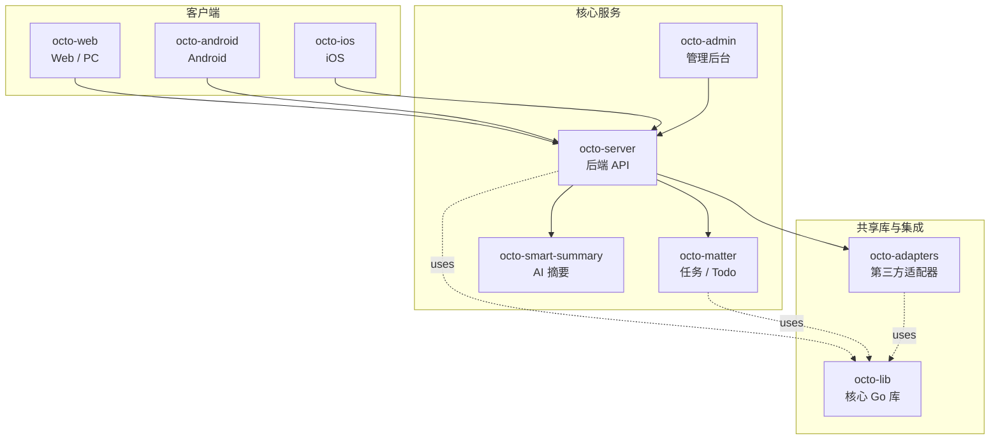

<p align="center">
  
  
</p>

<p align="center">
  <b>OCTO —— 为人和 AI Agent 协作而生的开源工作平台。</b><br/>
  <sub>让 <b>龙虾（Lobster / OpenClaw-powered digital double agents）</b>去「思」和「行」，让人专注于「品」。</sub>
</p>

<p align="center">
  <a href="https://github.com/Mininglamp-OSS"><b>🏠 OCTO 主页</b></a> ·
  <a href="#-快速开始"><b>🚀 快速开始</b></a> ·
  <a href="#-octo-生态"><b>📦 生态</b></a> ·
  <a href="./CONTRIBUTING.zh.md"><b>🤝 贡献</b></a>
</p>

<p align="center">
  <a href="./LICENSE"></a>
  <a href="./README.md"></a>
</p>

---

> 🌐 **语言**: [English](README.md) · **简体中文**

# OCTO Matter（简体中文）

> **轻量级任务 / Todo / Matter 服务** —— OCTO 客户端与龙虾 Agent 共用的通用行动项原语。

`octo-matter` 是一个职责聚焦的 Go 服务，负责管理 **matter**（任务 / Todo /
行动项）。它对外暴露 REST API，提供创建 / 修改 / 指派 / 关闭等能力，并通过
timeline 子模块记录每个 matter 上的活动（评论、状态变更、LLM 抽取出的
后续动作）。

## 🌟 为什么选 OCTO Matter

- **任务 + 时间线一体。** 每个 matter 自带 append-only 活动流，「这条任务发生过什么」是一次数据库查询，而不是跨 4 个微服务拼凑。
- **把聊天转为结构化工作。** 可插拔的 LLM 抽取器能把自由文本（聊天片段、会议纪要）转成结构化 matter 草稿 —— 龙虾只需一次调用即可产出候选 todo。
- **Notifier 抽象。** 内置一等的 `octo-server` IM notifier 与通用 HTTP Webhook 出口，matter 事件可以直接扩散到团队已经在用的工具里。

## 🚀 快速开始

```bash
git clone https://github.com/Mininglamp-OSS/octo-matter.git
cd octo-matter
go build -o octo-matter ./cmd

# 配置通过环境变量（完整列表见 internal/config/config.go）
export LLM_API_URL=https://api.example.com/v1
export OCTO_LLM_PROVIDER=compat # compat、openai 或 anthropic
export MYSQL_DSN='user:pass@tcp(127.0.0.1:3306)/matter?parseTime=true'

./octo-matter
```

Minimal external dependencies — MySQL + an LLM endpoint

LLM provider:

- `compat`（默认）：OpenAI 兼容的 `/v1/chat/completions`；`LLM_API_URL` 填 gateway 的 `/v1` base。
- `openai`：OpenAI 官方 Go SDK；`LLM_API_URL=https://api.openai.com/v1`。
- `anthropic`：Anthropic 官方 Go SDK；`LLM_API_URL=https://api.anthropic.com`（末尾带 `/v1` 也会兼容）。

## 📦 模块与架构

本模块下的顶层包：

| 路径 | 作用 |
|---|---|
| `cmd/` | 服务入口 + timeline 事务辅助 |
| `internal/config/` | 基于环境变量的配置加载 |
| `internal/handler/` | HTTP handler（matter / timeline / activity / extract） |
| `internal/service/` | 业务逻辑（访问控制 / LLM 抽取 / timeline） |
| `internal/repository/` | MySQL 仓储（matter / assignee / channel / timeline） |
| `internal/llm/` | LLM 客户端 —— OpenAI 兼容 gateway，以及 OpenAI / Anthropic 官方 SDK provider |
| `internal/notification/` | Notifier 接口 + OCTO-IM 实现 |
| `internal/apperr/` | 类型化应用错误 |
| `internal/model/` | 共享数据模型 |
| `internal/middleware/` | 鉴权 / 日志 / recovery 中间件 |
| `migrations/` | SQL schema 迁移 |

请求生命周期：

1. **Ingest（入站）** —— 人工 `POST /matters` 或 `/extract` 传自由文本。
2. **Access-control（访问控制）** —— 按组织 + 按频道的可见性规则。
3. **Persist（落库）** —— matter 记录 + 初始 timeline 记录在一个事务内写入。
4. **Notify（通知）** —— 通过已配置的 `Notifier`（OCTO IM / Webhook / 两者）推事件。
5. **Loop（闭环）** —— 后续更新继续追加到同一条 timeline，形成完整审计链路。

## 🔗 OCTO 生态

<!-- 共享片段：OCTO 仓库矩阵。9 个仓库之间保持一致。 -->



| 仓库 | 语言 | 职责 |
|---|---|---|
| [`octo-server`](https://github.com/Mininglamp-OSS/octo-server) | Go | 后端 API · 业务编排 · 龙虾 Agent 调度 |
| [`octo-matter`](https://github.com/Mininglamp-OSS/octo-matter) | Go | 任务 / Todo / Matter 微服务 |
| [`octo-smart-summary`](https://github.com/Mininglamp-OSS/octo-smart-summary) | Go | 基于 LLM 的会话摘要服务 |
| [`octo-web`](https://github.com/Mininglamp-OSS/octo-web) | TypeScript / React | Web 与 PC（Electron）客户端 |
| [`octo-android`](https://github.com/Mininglamp-OSS/octo-android) | Kotlin / Java | 原生 Android 客户端 |
| [`octo-ios`](https://github.com/Mininglamp-OSS/octo-ios) | Swift / Objective-C | 原生 iOS 客户端 |
| [`octo-admin`](https://github.com/Mininglamp-OSS/octo-admin) | TypeScript / React | 管理后台（租户 / 组织 / 用户 / 频道管理） |
| [`octo-lib`](https://github.com/Mininglamp-OSS/octo-lib) | Go | 共享核心库（协议 / 加密 / 存储 / HTTP） |
| [`octo-adapters`](https://github.com/Mininglamp-OSS/octo-adapters) | TypeScript / Python | 第三方集成（IM 桥接、AI 渠道） |

## 🧭 设计哲学

OCTO 遵循三条共用原则 —— 这套矩阵里的每个仓都一致：

1. **本地优先（Local-first）。** 能跑在用户本机的一切（对话、向量、智能体）都应尽量在本机完成。你的数据属于你；云是可选项，不是前置条件。
2. **人做「品」，AI 做「思」与「行」。** 人聚焦在品味（什么重要、什么对、该发什么）。龙虾（OpenClaw 驱动的数字分身）承担思考与执行。
3. **Release-as-product（每次发布即产品）。** 每一次开源切片都是一个自洽的产品，不是代码倾倒：一个 release 一次 squash，Apache 2.0，不夹带内部包袱，单仓即可复现。

## 🤝 贡献

欢迎提 Pull Request！开 PR 前请先读：

- [CONTRIBUTING.zh.md](CONTRIBUTING.zh.md) —— 工作流、分支模型、commit 规范
- [CODE_OF_CONDUCT.zh.md](CODE_OF_CONDUCT.zh.md) —— 社区行为准则

安全问题请按 [SECURITY.zh.md](SECURITY.zh.md) 上报，不要走公开 issue。

## 📄 许可

Apache License 2.0 —— 完整文本见 [LICENSE](LICENSE)，第三方致谢见 [NOTICE](NOTICE)。

---

<p align="center">
  <sub>由 <b>OCTO Contributors</b> 🐙 共同开发 · <a href="https://github.com/Mininglamp-OSS">Mininglamp-OSS</a></sub>
</p>
